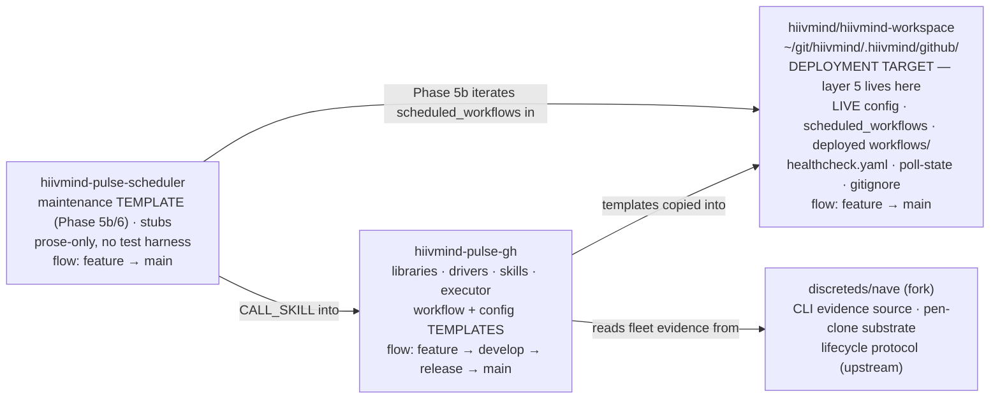

# hiivmind-pulse-gh — fleet program roadmap & backlog index

**Updated:** 2026-08-17 (agent-native fleet UI captured) · **One-page map of what is built, what is left, and where each item lives.**

> Read in this order: **Status at a glance** (what shipped) → **Layer-completeness matrix**
> (is it actually *runnable*) → **Cross-repo dependency map** (which repos an item spans) →
> **prioritized backlog**. The two matrices exist because "merged" kept hiding unbuilt runnable
> layers and cross-repo assumptions — see each section's callout.

The "F-series" fleet program built a control plane that reads/scores a repo fleet, proposes
guarded mutations, and (now) lands them. Most phases shipped as **tested libraries**; the
open work is about **making those libraries actually run end-to-end in production**, not just
pass in fixtures. The **propose** side now does (F10 closed 2026-07-30 — the F5–F9 audits run
on cadence and surface proposals in the maintenance PR). The **apply** side's interactive path
(single-repo, multi-repo, and now dependency-bump) is merged and live-proven; only the
**scheduled/deployed** apply layer remains dark.

---

## Status at a glance

| Phase | What it does | State |
|---|---|---|
| F0 | Nave fleet evidence snapshot | ✅ merged (#124) |
| F1 | Profiles / scorecards / adapters | ✅ merged (#125) |
| F2 | Fleet membership + profile metadata | ✅ merged (#126) |
| F3 | Dispatched healthchecks | ✅ merged (#127) |
| Pre-F4 | Nave dependency **evidence** | ✅ merged (#128) |
| **F4** | Dependency-**coherence adapters** (consume the evidence) | ✅ merged (#142) |
| F5 | Impact bindings / `integration_tested_sha` markers | ✅ merged (#129) |
| F6 | Nave pen mutations (propose) | ✅ merged (#130/#132) |
| F7 | Binding specializations / generated artifacts | ✅ merged (#133) |
| F8 | Generic plan sync | ✅ merged (#134) — driver `gh_api` wiring bug found + fixed, reconciliation live-proven (#151, 2026-08-16) |
| F9 | Dogfood overlays (Claude plugin/corpus) | ✅ merged (#136) |
| **F10** | **Runnable spine** (CLI drivers + triggers for F6–F9) | ✅ **complete** — spine #139; proposal fold #140; enrolled live (workspace #2). "Triggered end-to-end" gate **closed**. |
| F11 | Apply-mode (land a validated proposal) | ✅ merged (#138) — library+tests; **interactive driver + multi-repo apply v2 merged (#147); dependency-bump handoff merged (#149), both live-proven.** Scheduled/deployed apply, `advance_base`, and `allow` remain open. |

> **What "merged ✅" does and does not mean.** It means layers 1–3 (library →
> driver → skill) landed in **this repo**. It says nothing about whether the phase is
> *triggered* or *deployed to the live fleet* — the two layers that make it actually run.
> "F9 complete" read as done for weeks while F6–F9 had no driver at all. Read the
> **Layer-completeness matrix** below before trusting a ✅.

---

## Layer completeness — the "is it actually runnable?" matrix

Every phase is a five-layer ladder. A phase **runs in production** only when all five exist;
`merged ✅` above only asserts the first three, and only in `hiivmind-pulse-gh`.

1. **Library** — pure Python that owns the decisions (classify / count / gate / build proposal).
2. **Driver** — an argparse CLI (`*_run.py`) that assembles inputs, calls the library, writes + validates a result file.
3. **Skill** — a headless `SKILL.md` that *shells* the driver (`uv run …`), zero prompts. (A skill that cites a *function signature* instead of a command is not this layer — that was the F6–F9 trap.)
4. **Trigger** — a workflow definition (`session_poll` / `freshness` / `periodic`) or scheduler phase that invokes the skill unattended.
5. **Deployed** — that trigger **and** its config actually present in the **live workspace repo** (`hiivmind/hiivmind-workspace`, i.e. `~/git/hiivmind/.hiivmind/github/`), so a real cadence run exercises it.

| Phase | 1 Lib | 2 Driver | 3 Skill | 4 Trigger | 5 Deployed | Runs in prod? |
|---|:--:|:--:|:--:|:--:|:--:|---|
| F0 evidence | ✅ | ✅ | ✅ | ✅ | ✅ | ✅ (via healthcheck) |
| F1 profiles / scorecards | ✅ | ✅ | ✅ | ✅ | ✅ | ✅ (via healthcheck) |
| F2 fleet membership | ✅ | ✅ | ✅ | ✅ | ✅ | ✅ |
| F3 dispatched healthchecks | ✅ | ✅ | ✅ | ✅ | ✅ | ✅ (dogfooded) |
| Pre-F4 dependency **evidence** | ✅ | ✅ | ✅ | ✅ | ✅ | ✅ (evidence only) |
| **F4 dependency-coherence adapters** | ✅ | ✅ | ✅ | ✅ | ✅ | ✅ (via healthcheck; `python_manifest_lock_consistency` / `node_manifest_lock_consistency` / `fleet_dependency_coherence` scored) |
| F5 impact bindings | ✅ | ✅ | ✅ | ✅ `periodic` | ✅ (#2) | ✅ — `impact-audit` on cadence |
| F6 pen mutations | ✅ | ✅ (F10) | ✅ (F10) | ✅ `periodic` | ✅ (#2) | ✅ — proposals fold to PR body (#140) |
| F7 generated artifacts | ✅ | ✅ (F10) | ✅ (F10) | ✅ `periodic` | ✅ (#2) | ⚠️ enrolled; validated-abort until `generated.yaml` binding exists |
| F8 plan sync | ✅ | ✅ (F10) | ✅ (F10) | ✅ `periodic` | ✅ (#2) | ⚠️ reconciliation live-proven (#151, `hiivmind-pulse-gh#152`); no permanent binding deployed |
| F9 dogfood overlays | ✅ | ✅ (F10) | ✅ (F10) | ✅ `periodic` | ✅ (#2) | ✅ — via healthcheck + `marketplace-sync` |
| **F10 runnable spine** | ✅ | ✅ | ✅ | ✅ `periodic` + 4 flips | ✅ (#2) | ✅ — **gate closed** (fold #140 + enroll #2) |
| F11 apply-mode | ✅ | ✅ `apply_driver` (interactive, multi-repo v2, dependency-bump) | ⚠️ `gh-apply` (interactive, single-repo prose — now stale on 2 counts) | ❌ | ❌ | ⚠️ interactive proven live (incl. dependency-bump); scheduled sweep + `advance_base` open |

**Legend:** ✅ built & deployed · ⚠️ exists but not fully exercised yet · ❌ absent.

**F10 is closed: F5–F10 column 5 is now live** (proposal fold `hiivmind-pulse-gh` #140 +
enrollment `hiivmind/hiivmind-workspace` #2, both merged 2026-07-30). F7's remaining ⚠️ is
a *data* gap, not a code gap — the trigger fires but there is no bound work until the
`generated.yaml` binding file is added to the workspace (non-destructive validated-abort until
then). **F8 is different**: a live-proof (2026-08-16) found and fixed a real driver bug —
`plan_sync_run.py` never wired a real `gh_api` seam into its GitHub reads, so every scheduled
run failed every issue fetch with "GitHub API reader is unavailable" regardless of binding
config (PR #151). After the fix, all four reconciliation paths were proven against a real
bound doc + issue (`hiivmind-pulse-gh#152`): in_sync, github-side field drift → doc-side F6
proposal, doc-side drift → GitHub issue proposal, and a three-way conflict correctly
fail-closing the whole document (not just the conflicting field). The proof-vehicle binding
was removed afterward (`hiivmind-workspace`#4/#5) — no permanent `plan-sync.yaml` binding is
deployed, so F8 still does no real work on cadence, but the driver itself is now proven
correct. F11's interactive driver is now lit (live-proven, incl. the F11 dependency-bump
handoff #149); only the scheduled/deployed apply layers remain dark. (The live-proof
also found `~/git/hiivmind/.hiivmind/github` — the actual `CONFIG_DIR` root every driver
reads — sitting on an already-merged branch tip several commits behind `origin/main`,
distinct from the separate `~/git/hiivmind/hiivmind-workspace` checkout used for git
operations; fast-forwarded it back onto `main` as part of the proof.)

### Two flow facts that broke specs on contact (record so they stop recurring)

Both are now resolved, but kept here because the *pattern* is the lesson.

- **The `automation.scheduled_workflows` list lives in the WORKSPACE repo, not the scheduler
  repo.** The scheduler's `TEMPLATE-workspace-maintenance.md` Phase 5b was already *generic*
  over that list; composing F6–F9 onto the cadence was a **workspace-config** edit (+ deploying
  the 4 YAMLs, #2), not a scheduler-repo change. The F10 scheduler-composition spec assumed the
  opposite — the whole "scheduler PR" was actually a pulse-gh + workspace change.
- **`gh-workflow-run-headless` did not fold an inner driver's `proposals[]` / `findings` into
  the outer `workflow-run-result.yaml`.** The executor's `INVOKE skill X` projection invoked the
  sibling and discarded its result envelope, so a scheduled F6–F9 run surfaced **zero**
  proposals. Fixed in #140 (`lib/pulse/scripts/subresult_fold.py` + executor prose) — a small
  **`hiivmind-pulse-gh`** change, exactly as the "layer 4 defect, not a scheduler change"
  diagnosis predicted.

---

## Cross-repo dependency map

Pulse spans **four repos with three different branch flows**. A spec authored in one repo that
assumes a sibling's shape is the second recurring failure mode; this map is the antidote.

**Repo nodes**

| Repo | Role | Branch flow | Test harness |
|---|---|---|---|
| `hiivmind-pulse-gh` (this) | Libraries, drivers, skills, executor, workflow/config **templates** | `feature → develop → release → main` (three-tier) | ✅ `lib/pulse/scripts/tests/` |
| `hiivmind-pulse-scheduler` | Maintenance **template** (Phase 5b runs `scheduled_workflows`; Phase 6 renders `proposed_actions`) + per-workspace stubs | `feature → main` | ❌ prose-only |
| `hiivmind/hiivmind-workspace` (`~/git/hiivmind/.hiivmind/github/`) | **Live** config: catalog, `automation.scheduled_workflows`, deployed `workflows/`, `healthcheck.yaml`, `poll-state`, `*-result.yaml` gitignore | `feature → main` | ❌ data repo |
| `discreteds/nave` (fork) | Fleet evidence source (F0); pen-clone substrate (apply-mode); lifecycle protocol | fork PRs | n/a |

**Item → repos it spans** (the decomposition to do *before* branching):

| Open item | pulse-gh | scheduler | workspace | nave | The gotcha |
|---|:--:|:--:|:--:|:--:|---|
| **F10 triggered end-to-end** | ✅ **folding fix (real work)** | ○ generic already; doc-only | ✅ enroll list + deploy 4 YAMLs | — | list + deploy live in **workspace**; the code fix is in **pulse-gh** |
| **Apply-mode remaining: `advance_base` + scheduled deploy** | ✅ driver done (single + multi-repo + dependency-bump, live-proven) | — | ⚠️ F5/F8 base-writer open | ✅ `nave pen create` owns clone writes (no `PULSE_PEN_ROOT` bridge); reports `observed_tree_sha` (#7) | interactive proven; base-writer + scheduled layers remain |
| ~~**F4 dependency-coherence adapters**~~ ✅ **DONE** | ✅ adapters | — | ○ evidence already present | ○ evidence source | mostly pulse-gh; evidence already flows |
| ~~**F11 dependency-bump handoff**~~ ✅ **DONE** | ✅ source kind + driver | — | ○ n/a | ✅ tree_sha fix (#7) | live-proven end to end (hiivmind-corpus#58) |
| **`relationships.yaml` schema drift** | ✅ | — | — | — | 1-repo (needs schema-vs-evaluator ruling) |
| **Stale workspace catalog** | — | — | ✅ data fix | — | 1-repo, **data not code** |
| **Nave lifecycle protocol** | — | — | — | ✅ upstream | 1-repo, gated on nave |

---

## The open backlog, prioritized

### 🔴 P1 — "Make it run in production" (apply's scheduled/deployed gap)
The libraries exist; the *propose* side runs on cadence (F10 closed 2026-07-30). The **apply**
side's interactive path now runs too — single-repo, multi-repo (#147), and dependency-bump
(#149) all merged and live-proven against real repos. What remains is making apply
*scheduled + deployed*.

| Item | Why it matters | Source |
|---|---|---|
| ~~**F10 last mile: proposal folding + live enrollment**~~ ✅ **DONE 2026-07-30** | Proposal fold (#140) + live enrollment (workspace #2) merged; F10's "triggered end-to-end" gate is closed. The propose/mutate phases F5–F9 now run daily and surface proposals in the maintenance PR body. | `2026-07-29-f10-scheduler-composition.md` · `2026-07-30-f10-followups.md` |
| ~~**Interactive apply driver + multi-repo apply v2**~~ ✅ **DONE 2026-08-15** | `apply_driver` assembles `execute → reconcile` end-to-end — one proposal → N repos, one pen/journal/rollup, per-repo independent outcomes. Live-proven (agent-kernel, then swingle + hiivmind-corpus). Fleet naming = explicit `repos` ∪ optional `repo_selector`. | [`2026-08-15-multi-repo-apply.md`](../superpowers/plans/2026-08-15-multi-repo-apply.md) · [`2026-08-15-multi-repo-apply-design.md`](../superpowers/specs/2026-08-15-multi-repo-apply-design.md) |
| ~~**F4 dependency-coherence adapters**~~ ✅ **DONE 2026-08-13** | Pre-F4 materialized the evidence; the coherence adapters that consume it are merged (#142). Closed the read-spine gap. | [`2026-07-13-f4-dependency-adapters.md`](../superpowers/plans/2026-07-13-f4-dependency-adapters.md) · [`2026-08-13-f4-deferred-scope.md`](2026-08-13-f4-deferred-scope.md) |
| ~~**F11 dependency-bump handoff object**~~ ✅ **DONE 2026-08-16** | The flagship neutral apply use-case: turns an F4 `DivergenceFinding` into a guarded `Proposal` (`selection` / `expected_shas` / per-manager bump / `bound_paths`). Merged #149, live-proven (`hiivmind-corpus#58`). Live-proof surfaced and fixed a real nave bug: `tree_sha` was sourced from the tree endpoint's own (commit) `sha`, not the actual tree object hash (nave #7). | [`2026-08-15-dependency-bump-handoff-design.md`](../superpowers/specs/2026-08-15-dependency-bump-handoff-design.md) · [`2026-08-15-dependency-bump-handoff.md`](../superpowers/plans/2026-08-15-dependency-bump-handoff.md) |
| **Scheduled/deployed apply + real `advance_base`** | Interactive apply (all three source kinds) is proven; the *scheduled* sweep (layer-4 trigger + workspace deployment) and the real F5/F8 base-writer on the merged SHA remain open. Gated on the `allow` confirmation-model design (🔵 v2). **The top open item.** | [`2026-07-29-apply-mode-v2-deferrals.md`](2026-07-29-apply-mode-v2-deferrals.md) § A.2 / § B |

### 🟠 P2 — Correctness / data (cheap, one is a real bug)
| Item | Why it matters | Source |
|---|---|---|
| **`relationships.yaml` schema drift** | Produces a **wrong healthcheck result** — the only active correctness bug. Needs a decision on which side (schema vs `evaluate_checks.py`) is authoritative. | [`2026-07-11-relationships-schema-drift.md`](2026-07-11-relationships-schema-drift.md) |
| ~~**F8 driver never fetched real GitHub evidence**~~ ✅ **FIXED 2026-08-16** | `plan_sync_run.py` never wired a real `gh_api` seam into its real (non-injected) collector call, so every scheduled run failed every issue read with "GitHub API reader is unavailable" — masked because the only end-to-end test injected a full `collector=` override. Found live-testing F8; fixed and all four reconciliation paths (in_sync, both patch directions, conflict fail-closed) proven against real data. | `hiivmind-pulse-gh#151` |
| **Stale workspace repo catalog** | Wrong repo catalog in the dogfood workspace config (`~/git/hiivmind/.hiivmind/github/config.yaml`) — data, not code. | [`2026-07-11-workspace-config-stale-catalog.md`](2026-07-11-workspace-config-stale-catalog.md) |

### 🟡 P3 — Nave / upstream / installability
| Item | Why it matters | Source |
|---|---|---|
| **Nave machine-readable lifecycle protocol** | Upstream proposal to the nave fork (`capabilities`/`scan`/`pull --json`). Depends on nave, not pure pulse work. | [`2026-07-13-nave-json-lifecycle-protocol.md`](2026-07-13-nave-json-lifecycle-protocol.md) |
| **Nave release pinning** | Tag a `discreteds/nave` release + fill `Minimum Nave version: TBD`. Needed only before external installability (single-developer today). | [`2026-07-22-f1-f8-phase-deferrals.md`](2026-07-22-f1-f8-phase-deferrals.md) § 2 |

### 🟢 P4 — Small cleanups (no real consumer yet)
| Item | Source |
|---|---|
| **F7 validator/manifest follow-ups** — 3a manifest-validity enforcement (best small cleanup), 3b–3d validator edge limits | [`2026-07-22-f1-f8-phase-deferrals.md`](2026-07-22-f1-f8-phase-deferrals.md) § 3 |
| **F8 milestone dead-field** — cosmetic forward hook (dead-carried catalog tuple) | [`2026-07-22-f1-f8-phase-deferrals.md`](2026-07-22-f1-f8-phase-deferrals.md) § 4 |
| **`gh-apply` skill drift** — the skill still documents single-repo v1 ("multi-repo blocked") and the pre-#147/#149 driver CLI; update its phases to the multi-repo + dependency-bump flow | `skills/gh-apply/SKILL.md` |

### 🔵 v2 — deferred by design boundary
| Item | Source |
|---|---|
| **`allow` (unattended direct push) + scheduled auto-apply** — behind `allow_scheduled` + a workspace apply policy; the confirmation model changes, so **design first** | [`2026-07-29-apply-mode-v2-deferrals.md`](2026-07-29-apply-mode-v2-deferrals.md) § B |
| **Single-repo-atomic Path A push** — only if a future Nave surface yields per-repo exec signal | [`2026-07-29-apply-mode-v2-deferrals.md`](2026-07-29-apply-mode-v2-deferrals.md) § B |
| **Non-neutral multi-repo** — plan-sync / generated-artifact / marketplace-sync remain single-repo; the driver/reconcile are source-agnostic but their fleet binding shapes need a spec | [`2026-08-15-multi-repo-apply-design.md`](../superpowers/specs/2026-08-15-multi-repo-apply-design.md) § 10 |
| **F8: GitHub Projects (v2) field sync** — sync a bound doc against a linked Project item's custom fields (Status, Priority, Iteration, arbitrary user fields), not just the issue's own title/state/assignees/milestone/body. GraphQL-only surface, no write path exists yet, issue↔project cardinality (0..N) needs resolving. Design first. | [`2026-08-17-f8-projects-v2-field-sync.md`](2026-08-17-f8-projects-v2-field-sync.md) |
| **Extract `lib/pulse` as a standalone Python package** — 53 scripts invoked by `{PLUGIN_ROOT}`-relative path from every skill, no real install/version, only 2 of 53 have entry points. Concretizes audit F7's "neutral runtime root" recommendation; mirrors the Nave extraction precedent for the Python half. Design first (PEP-723-vs-installed-package fork). | [`2026-08-17-lib-pulse-package-extraction.md`](2026-08-17-lib-pulse-package-extraction.md) |
| **Agent-native fleet UI** — a visual app (BuilderIO `agent-native`) presenting projects/statuses/workflows/issues, surfacing discrepancies (`findings`) and approvals from the existing typed result contracts, with an LLM agent panel that can invoke skills/`lib/pulse`/Nave tasks. Largest-scope open item; depends on `lib/pulse` extraction landing first. Design first. | [`2026-08-17-agent-native-fleet-ui.md`](2026-08-17-agent-native-fleet-ui.md) |

### ⚪ Non-goals & tooling (recorded so they aren't re-proposed)
- **Auto-merge** — permanent non-goal; Pulse opens PRs and detects merges, never merges. ([apply-mode v2](2026-07-29-apply-mode-v2-deferrals.md) § C)
- **agy `write_file` permission drift** — a `swingle-verify agy` item in the sdd-dispatch plugin, **not** a hiivmind-pulse-gh change. ([apply-mode v2](2026-07-29-apply-mode-v2-deferrals.md) § E)

---

## Suggested sequencing

1. ~~**F10 last mile**~~ — ✅ done 2026-07-30 (fold #140 + enroll #2); the propose side runs on cadence.
2. ~~**F4 adapters**~~ — ✅ done 2026-08-13 (#142); read-spine gap closed.
3. ~~**Interactive apply driver + multi-repo apply v2**~~ — ✅ done 2026-08-15 (#147); live-proven against real repos.
4. ~~**F11 dependency-bump handoff object**~~ — ✅ done 2026-08-16 (#149); live-proven, flagship use-case link closed (F4 § C).
5. **`relationships.yaml` schema drift** — cheap, and the one live correctness bug.
6. **Scheduled/deployed apply + `advance_base`** — gated on the `allow` design (🔵 v2).
7. **Binding files for the enrolled F7/F8 audits** — add `generated.yaml` / `plan-sync.yaml` to the workspace so `generated-artifact-audit` / `plan-sync` have real work instead of validated-abort. Data, when there's something to bind.
8. Everything else as its feature gains a real consumer.

> **Before branching any multi-repo item, decompose it through the Cross-repo dependency map
> above** — which repos it spans, which sibling shape it assumes, and which branch flow each PR
> targets. The two recurring failures (a whole runnable layer silently unbuilt; a spec assuming
> the wrong repo) both come from skipping this step.

## Backlog docs (full detail lives here)
- [`2026-08-15-multi-repo-apply.md`](../superpowers/plans/2026-08-15-multi-repo-apply.md) — multi-repo apply v2 implementation plan
- [`2026-08-15-multi-repo-apply-design.md`](../superpowers/specs/2026-08-15-multi-repo-apply-design.md) — multi-repo apply v2 design spec
- [`2026-08-15-dependency-bump-handoff-design.md`](../superpowers/specs/2026-08-15-dependency-bump-handoff-design.md) — F11 dependency-bump handoff design spec
- [`2026-08-15-dependency-bump-handoff.md`](../superpowers/plans/2026-08-15-dependency-bump-handoff.md) — F11 dependency-bump handoff implementation plan
- [`2026-08-13-f4-deferred-scope.md`](2026-08-13-f4-deferred-scope.md) — F4 v1 scope cuts (Conda, cardinality, F11 handoff, per-package overrides) deferred from the post-review plan revision
- [`2026-07-29-apply-mode-v2-deferrals.md`](2026-07-29-apply-mode-v2-deferrals.md) — apply-mode (F11) v2 / production-wiring / dependent items
- [`2026-07-22-f1-f8-phase-deferrals.md`](2026-07-22-f1-f8-phase-deferrals.md) — F1–F8 roll-up (apply-mode #1 now ✅ resolved; #2–#4 open)
- [`2026-07-13-nave-json-lifecycle-protocol.md`](2026-07-13-nave-json-lifecycle-protocol.md) — upstream Nave protocol proposal
- [`2026-07-11-relationships-schema-drift.md`](2026-07-11-relationships-schema-drift.md) — schema-drift correctness bug
- [`2026-08-17-f8-projects-v2-field-sync.md`](2026-08-17-f8-projects-v2-field-sync.md) — F8 Projects (v2) custom-field sync, no-spec capability gap
- [`2026-08-17-lib-pulse-package-extraction.md`](2026-08-17-lib-pulse-package-extraction.md) — extract `lib/pulse` as a standalone Python package, no-spec architectural item
- [`2026-08-17-agent-native-fleet-ui.md`](2026-08-17-agent-native-fleet-ui.md) — agent-native visual fleet UI proposal, no-spec, largest open item
- [`2026-07-11-workspace-config-stale-catalog.md`](2026-07-11-workspace-config-stale-catalog.md) — stale workspace data

> Design-of-record for built/planned phases lives under `../superpowers/plans/` and
> `../superpowers/specs/`; audits under `../superpowers/audits/`. This index only tracks
> **open work**; per-phase "what/how" is in `../f-series-explained.md`.
