# Platform Development Roadmap Design

**Date:** 2026-08-19  
**Status:** Approved  
**Decision:** The platform direction is committed  
**Scope:** Architecture, test and CI strategy, dependency map, decision register, and delivery sequence

## 1. Purpose

This document defines the development roadmap for the Hiivmind Pulse platform.
It replaces backlog order with an evidence-based delivery sequence.
It does not replace the detailed design for each program.
Each program still needs its own design and implementation plan.

The [platform foundation program map](2026-08-19-platform-foundation-program-decomposition-design.md)
decomposes Phases 0 and 1 into separate review units.

The roadmap uses the live code, workspace configuration, tests, and sibling repositories as evidence.
Backlog labels alone are not evidence of implementation status.

## 2. Executive decision

Hiivmind Pulse will become a product platform.
The platform will include these surfaces:

- A distributable Python SDK
- Complete CLI entry points
- A FastAPI service
- An MCP server
- Native Nave bindings
- A durable run and fleet-state model
- A governed fleet user interface

The platform will keep the existing safety model.
A new surface must not create a second mutation path.
All mutations must use the same authorization and apply services.

The roadmap uses two coordinated lanes after the foundation phase:

1. The platform lane builds the SDK, service, data model, and user interface.
2. The operations lane completes scheduled, PR-gated apply and production deployment.

Both lanes use the shared platform contracts after Phase 1.
They join operationally at the governed approval flow in the user interface.

## 3. Current system

### 3.1 Five delivery layers

The current five-layer model is correct.
The roadmap keeps this model.

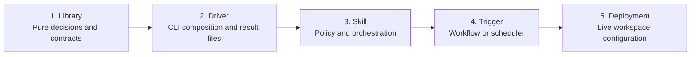

A capability is not in production until all five layers exist.
A merged library is not a deployed capability.

### 3.2 Current repository topology

The current control plane spans four repositories.
The product platform adds a package repository and a user-interface repository.

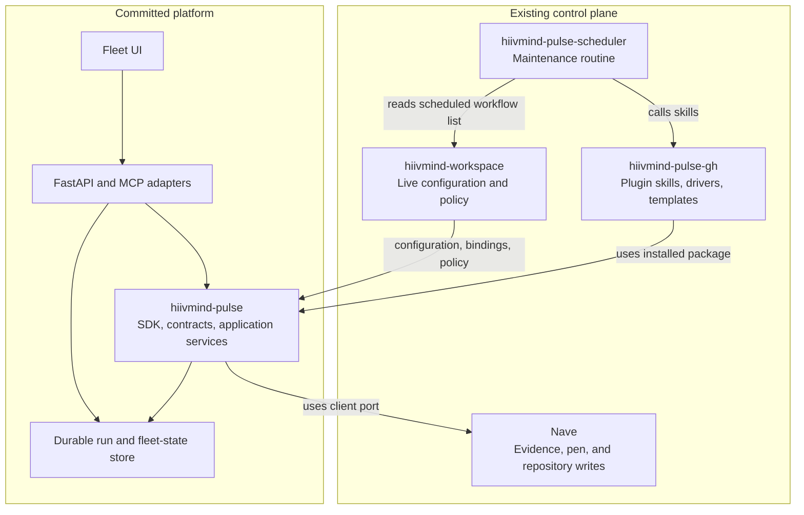

### 3.3 Current strengths

The current system has these strengths:

- Pure decision modules exist for the main fleet capabilities.
- Drivers write versioned result contracts.
- The apply path uses authorization, leases, fences, journals, and PRs.
- Nave owns clone-write repository operations.
- The workspace owns live configuration and deployment.
- The scheduler already reads the workspace workflow list.
- The Python test suite covers many pure and acceptance paths.

### 3.4 Current faults and gaps

The review found these high-impact gaps:

1. The repository has no test CI workflow.
2. The `develop` branch has no branch protection.
3. The `main` branch has no required status checks.
4. The relationship schema has three incompatible shapes.
5. The backlog contains stale implementation and dependency claims.
6. The `gh-apply` skill still describes the single-repository flow.
7. Result files are transient and cannot support a standing user interface.
8. Scheduled apply is incorrectly coupled to direct base-branch push.
9. The package, service, persistence, and user-interface boundaries are not stable.
10. Cross-repository contracts have no compatibility CI.

## 4. Architecture rules

The platform must obey these rules.

### 4.1 One implementation of each decision

The SDK owns the business rules and typed contracts.
The CLI, FastAPI, MCP, skills, and user interface call the same application services.
They must not implement independent policy or mutation rules.

### 4.2 One governed mutation path

Every repository mutation must use this sequence:

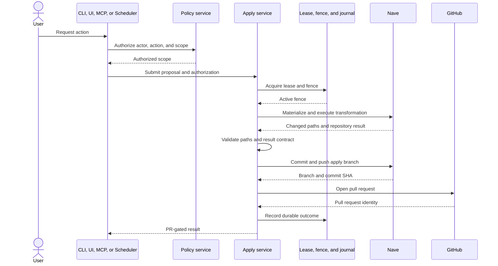

Pulse never merges the pull request.
Direct base-branch push is a separate future capability.

### 4.3 Nave owns repository writes

Pulse must not add clone-write Git operations.
Nave owns materialization, execution, commit, push, and reset.

The SDK will use a `NaveClient` port.
The port will have two implementations:

- The current CLI and JSON implementation
- A native PyO3 implementation

The implementations must return the same typed result and error shapes.

### 4.4 Transport adapters do not own policy

FastAPI and MCP are adapters.
They do not replace the SDK.
They do not define separate authorization models.

The platform will use one action catalog.
Each action will declare these facts:

- Input schema
- Output schema
- Required actor scope
- Mutation class
- Approval policy
- Supported execution modes
- Result contract

The CLI, FastAPI, and MCP adapters will expose this catalog.

### 4.5 Workspace configuration is versioned data

The workspace owns live policy, bindings, and deployment data.
The SDK owns the schema and validator for that data.

Every workspace file needs these properties:

- A canonical shape
- A schema version
- A deterministic validator
- A migration path
- A declared owner
- Fixture coverage

### 4.6 Result files are transport artifacts

The current `*-result.yaml` files are per-machine artifacts.
A later run overwrites them.
The files are not durable authority.

The service will ingest result contracts into a durable run model.
The durable model will preserve immutable history and current projections.

## 5. Target platform architecture

### 5.1 Package structure

The new package will own the full fleet-governance engine.
It will not be a helper for one user-interface screen.

The package design will include these logical modules:

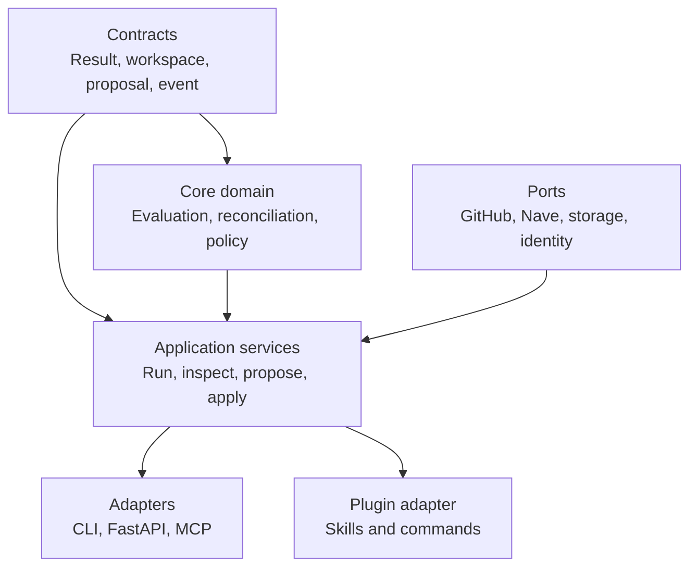

The design can use one repository and one distribution at first.
The module boundaries remain explicit inside that distribution.

### 5.2 Durable run and fleet-state model

The durable model must separate immutable events from current projections.

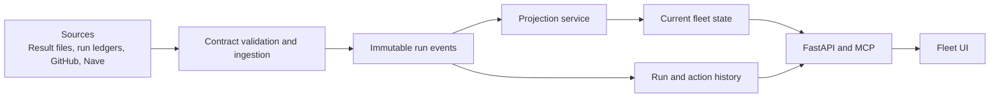

The event model must include these identities:

- Workspace
- Repository
- Run
- Step
- Proposal
- Action
- Actor
- Machine
- Pull request
- Evidence snapshot

The projection model must include these views:

- Fleet and repository status
- Findings
- Proposed actions
- Human questions
- Approval state
- Apply state
- Pull request state
- Governance score and coverage
- Run history

### 5.3 Local and hosted modes

The platform must support local and hosted deployment modes.
This requirement is one capability with configurable adapters.
It is not two separate products.

The local mode can use local identity and SQLite.
The hosted mode can use team identity and PostgreSQL.
Both modes must use the same application-service and storage interfaces.

The architecture design must settle these items before implementation:

- Tenant identity
- Workspace ownership
- Credential storage
- Actor and machine identity
- Data retention
- Secret redaction
- Approval ownership
- Cross-machine lease behavior

### 5.4 Product focus

The user interface will focus on GitHub fleet governance and governed remediation.
It will not copy a general internal developer platform.

The product focus includes these functions:

- Fleet visibility
- Evidence-backed findings
- Governance coverage
- Proposed remediation
- Human questions
- Approval and rejection
- Apply and PR status
- Run history
- Agent access through MCP

## 6. Test and CI strategy

### 6.1 Current test posture

The repository has broad local pytest coverage.
The tests cover pure logic, contracts, drivers, locks, and acceptance flows.

The acceptance suite injects important external seams.
It does not prove the full production path through GitHub and Nave.
The static skill tests inspect commands but do not run skill shell paths.

The repository has no PR test workflow.
The existing workflows only label issues and deploy GitHub Pages.

### 6.2 Required CI layers

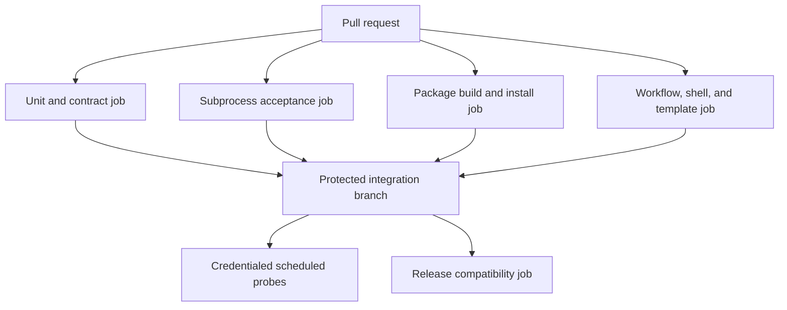

### 6.3 Pull-request jobs

#### Unit and contract job

This job will run the supported Python matrix.
It will run the full pytest suite.
It will validate result, workspace, proposal, and event fixtures.

#### Subprocess acceptance job

This job will use temporary Git repositories.
It will run installed console scripts.
It will use a pinned Nave binary without GitHub credentials.
It will cover locking and crash-resume behavior.

#### Package build and install job

This job will build the wheel and source distribution.
It will install the package in a clean environment.
It will import the public SDK.
It will run all supported console entry points.

#### Static operational job

This job will run these validations:

- GitHub Actions syntax
- Shell syntax and ShellCheck
- YAML template parsing
- Workflow lint
- Skill-to-driver references
- Workflow-to-skill references
- Result-kind references

### 6.4 Workspace CI

The package will provide a `pulse validate-workspace` command.
The workspace repository will run this command in CI.

The command will validate these items:

- Workspace schema versions
- Relationship data
- Repository catalog data
- Scheduled workflow references
- Binding references
- Transformation references
- Authorization references
- Result-file ignore rules
- Unknown keys

### 6.5 Scheduler CI

The scheduler repository will validate these items:

- Stub constants
- Template references
- Skill identifiers
- Expected result kinds
- Phase order
- Fixture branch and PR behavior

### 6.6 Credentialed probes

Credentialed probes will not block ordinary pull requests.
They will run on a schedule or by manual request.

The probe set will include these scenarios:

- Read-only GitHub status and healthcheck
- Nave capability and lifecycle compatibility
- Synthetic PR-gated apply in a fixture repository
- FastAPI and MCP contract parity
- Released SDK and Nave compatibility

The probes must retain sanitized logs and validated result artifacts.

### 6.7 Branch gates

The repository will require the deterministic CI jobs on `develop` and `main`.
The repository will keep the pull-request review gate.

The CI design must not use exact test counts as an invariant.
The pull-request jobs must not depend on live GitHub API state.

## 7. Dependency map

The following graph defines the program dependencies.
A line means that the source capability must exist before the target capability can complete.

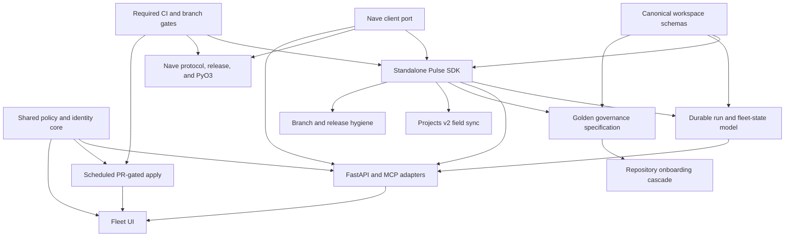

### 7.1 Critical platform path

The critical platform path is:

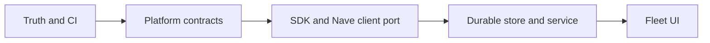

### 7.2 Parallel operations path

The operations path starts after the shared contracts in Phase 1.
The native Nave lane starts at the same point.
The service can start with the CLI Nave adapter.
All three lanes join before the governed user interface is complete.

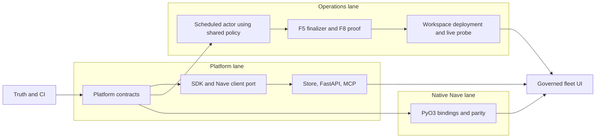

## 8. Roadmap phases

### Phase 0: Establish truth and delivery safety

#### Goal

Make repository state, healthcheck data, and merge gates trustworthy.

#### Deliverables

- Canonical workspace schema
- Schema version and migration rules
- Relationship data migration
- Evaluator correction
- Workspace validator
- Backlog status correction
- `gh-apply` documentation correction
- Pull-request CI in `hiivmind-pulse-gh`
- Workspace validation CI
- Scheduler structure CI
- Required checks on `develop` and `main`

#### Exit criteria

- The live relationship file passes the canonical schema.
- Known project links receive the correct healthcheck result.
- Every pull request to `develop` runs deterministic CI.
- A tracked audit table gives current evidence for every open backlog item.
- No open row claims that resolved F4, F10, or F11 work is not implemented.

### Phase 1: Define platform contracts

#### Goal

Define ownership and stable interfaces before code moves.

#### Deliverables

- Repository ownership design
- Package and module boundary design
- Public SDK API
- Workspace schema family
- Run and event contract family
- Storage interfaces
- `NaveClient` interface
- GitHub client interface
- Identity interface
- Policy and approval interface
- Application-service interface
- Local and hosted deployment design

#### Exit criteria

- Every current module has a target owner.
- Each public interface has a version rule.
- The ownership design assigns every policy rule to one SDK module.
- The interface map shows that all mutation surfaces call one authorization and apply service.
- The interface matrix assigns local and hosted adapters to the same storage and identity interfaces.

### Phase 2: Extract and release the SDK and start the native Nave lane

#### Goal

Make the fleet engine installable and reusable outside the plugin checkout.

#### Pulse deliverables

- Distributable package
- Stable public imports
- Complete CLI entry points
- Plugin adapter migration
- Build and release CI
- Version policy
- Compatibility policy
- Plugin dependency pin

#### Nave client deliverables

- Provider contract
- CLI and JSON implementation
- Lifecycle capability negotiation
- Release pinning

#### Parallel native Nave deliverables

- Native PyO3 bindings
- Async bridge
- Packaging decision
- CLI and native parity tests

The native Nave lane does not block the start of Phase 3.
The CLI and JSON adapter provides the first service implementation.
The native lane must complete before Phase 4 completes.

#### Exit criteria

- A clean machine installs the Pulse package.
- The package works without the plugin source path.
- The plugin uses the installed package.
- The CLI and JSON Nave adapter satisfies the provider contract.
- The native lane has an approved binding design and working prototype.

### Phase 3: Build the service and complete production operations

This phase has two lanes.

The native Nave lane continues during this phase.
It completes production bindings, packaging, and provider-parity tests.

#### Service lane deliverables

- Durable event store
- Projection service
- Run and result ingestion
- FastAPI adapter
- MCP adapter
- Read-only fleet APIs
- Read-only run APIs
- Action catalog
- Shared authorization enforcement
- Audit events

#### Operations lane deliverables

- Scheduled actor support
- Scheduled `mutation_policy: allow-listed`, PR-gated apply
- PR-gated terminal behavior
- Workspace apply-policy schema
- F5 finalizer
- Common finalizer dispatch
- F8 finalizer production proof
- Apply workflow deployment
- Synthetic fixture-repository probe
- Real binding deployment for valid consumers

Here, `allow-listed` means that workspace authorization limits the transformation, repositories, and paths.
It does not mean direct base-branch push with `mutation_policy: allow`.

#### Exit criteria

- A service restart does not lose run history.
- The CLI, FastAPI, and MCP surfaces return equivalent contract data.
- A scheduled fixture run opens a governed pull request.
- The scheduled run never merges the pull request.
- Reconciliation and finalization appear in durable history.
- Scheduled and interactive runs record the same authorization decision for the same action and scope.

### Phase 4: Deliver the fleet user interface

#### Goal

Give operators a standing view of fleet state and governed remediation.

#### Deliverables

- Fleet overview
- Repository detail
- Governance score and coverage views
- Findings view
- Proposed-action view
- Human-question view
- Run history
- Pull-request and apply status
- Approval and rejection flow
- Agent panel through MCP
- Local deployment adapter
- Hosted deployment adapter

#### Exit criteria

- The user interface does not call GitHub or Nave directly.
- Every mutation includes actor, policy, authorization, journal, and outcome data.
- A user can trace a finding from evidence to final outcome.
- Local and hosted modes use the same application services.
- The native Nave adapter passes provider-parity and release-compatibility tests.

### Phase 5: Expand fleet capabilities

This phase adds capabilities to the stable platform.

The initial order is:

1. Golden governance specification and parity reconciliation
2. Projects v2 custom-field synchronization
3. Repository onboarding cascade
4. Non-neutral multi-repository bindings
5. Stale merged-branch detection
6. Stale release-object detection
7. Stale release-branch and PR detection
8. Full dependency cardinality and workspace modeling
9. Native Conda and additional dependency ecosystems
10. Milestone alignment, changelog rollup, and dead-glob detection

Each capability must use the SDK contracts and shared policy services.
Its design can start after Phase 1.
Its implementation can use the existing driver, skill, and trigger path before the API and user-interface adapters are complete.

## 9. Decision register

### 9.1 Decisions required before Phase 1 completes

| Decision | Owner | Required evidence | Output |
|---|---|---|---|
| Canonical workspace schema | Pulse SDK and workspace | All writers, readers, templates, and live files | Versioned schema and migration |
| Package boundary | Pulse SDK | Module and caller inventory | Ownership and public API |
| Durable model | Pulse SDK and service | One complete maintenance and apply run | Event and projection design |
| Identity model | Service and workspace | Local and hosted actor flows | Identity and tenant interfaces |
| Policy gateway | Pulse SDK and workspace | One read action and one mutation action | Action and approval model |
| Scheduled apply | Pulse plugin and workspace | Threat model and fixture scenario | PR-gated scheduled policy |
| Nave native interface | Nave | One synchronous and one Tokio prototype | Binding and async design |
| Cross-repository CI | Contract producers and consumers | Producer and consumer contract inventory | Compatibility test matrix |
| Product wedge | Fleet UI | Primary-source competitor analysis | Fleet-governance product scope |

### 9.2 Decisions that can wait

These decisions are not on the platform critical path:

- Direct base-branch push with `mutation_policy: allow`
- Per-repository atomic Path A push
- Native Conda support
- Per-package dependency policy overrides
- Milestone and changelog behavior
- Dead-glob age threshold
- Stale-branch age threshold
- Stale-release age threshold
- F8 milestone dead-field disposition

The capabilities remain in the backlog.
The later program designs will settle their policies.

## 10. Backlog normalization

The backlog will use four views.

### 10.1 Program view

The program view will use these groups:

- Platform and SDK
- Production operations
- Fleet governance
- GitHub synchronization
- Dependency ecosystems
- Operational hygiene

### 10.2 Capability state

Each capability will use these states:

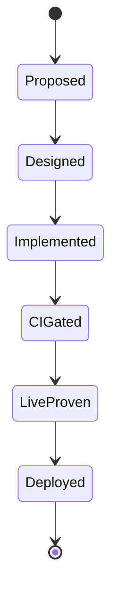

A state change needs evidence.
A pull request number alone proves only implementation.

### 10.3 Dependency type

Each dependency will use one type:

- Hard prerequisite
- Enabling dependency
- Operational deployment dependency
- Optional synergy

### 10.4 Decision record

Each unresolved decision will include these fields:

- Owner
- Evidence requirement
- Decision gate
- Current status
- Affected interfaces

## 11. Required backlog corrections

The backlog update that follows this roadmap must make these corrections:

1. Add CI and branch gates as a Phase 0 capability.
2. Mark the workspace catalog error as resolved after one live identity check.
3. Remove the historical F4 dependency from apply sequencing.
4. Split F5 finalization from the existing F8 finalizer.
5. Replace the old no-driver and clone-bridge claims.
6. Promote `gh-apply` drift to a safety-documentation correction.
7. Split scheduled PR-gated apply from direct-push `allow`.
8. Split release-object staleness from release-branch staleness.
9. Split package extraction, service adapters, persistence, and user interface into programs.
10. Track the lockstep housekeeping pair as two deliverables.

## 12. Cross-repository delivery rules

Each program design must name every affected repository.
It must name the branch flow for each repository.
It must name the producer and consumer of each contract.

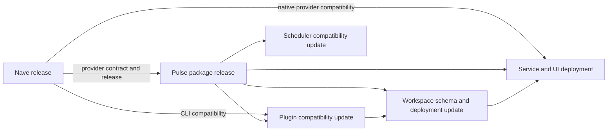

A cross-repository release must include compatibility evidence before deployment.

## 13. Non-goals

This roadmap does not authorize implementation.
Each architectural program still needs a design and implementation plan.

The roadmap does not add auto-merge.
Pulse will continue to open pull requests and detect merges.

The roadmap does not permit direct Git writes from Pulse.
Nave remains the repository-write engine.

The roadmap does not make transient result files authoritative.
The durable model will ingest and preserve their validated contents.

The roadmap does not turn the fleet user interface into a general internal developer platform.
The product focus remains GitHub fleet governance and governed remediation.

## 14. Completion definition

The platform roadmap is complete when all Phase 4 exit criteria are true.
Phase 5 is continuous capability expansion.

The platform completion evidence must include these items:

- Required CI on integration and release branches
- Versioned package and workspace contracts
- Released Pulse SDK
- Released compatible Nave provider
- Durable run history
- FastAPI and MCP contract parity
- Scheduled PR-gated apply proof
- Governed user-interface approval proof
- Cross-repository compatibility evidence
