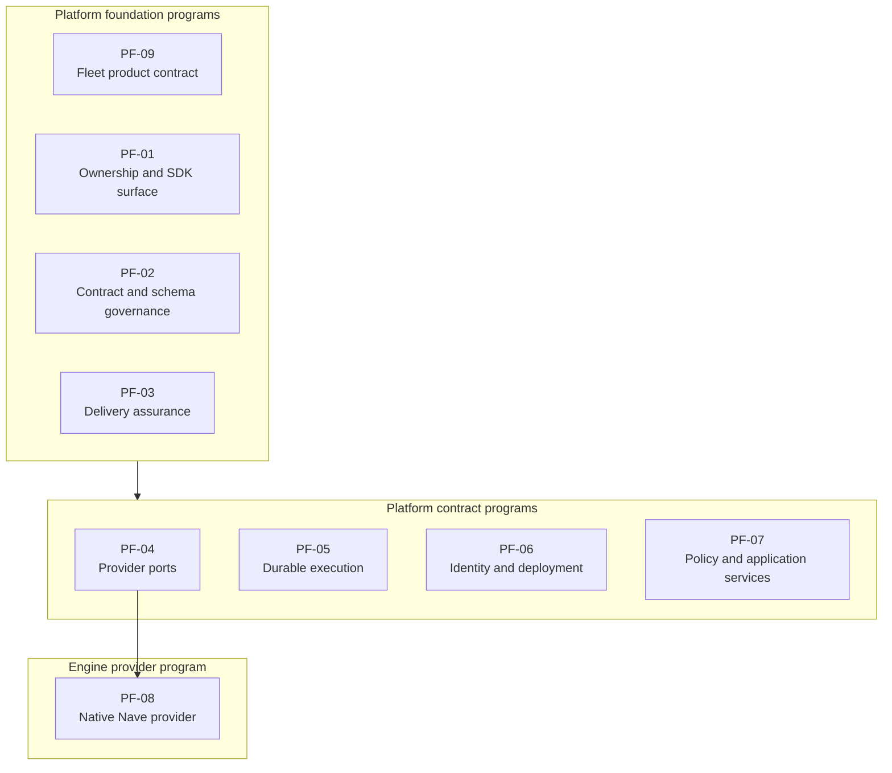
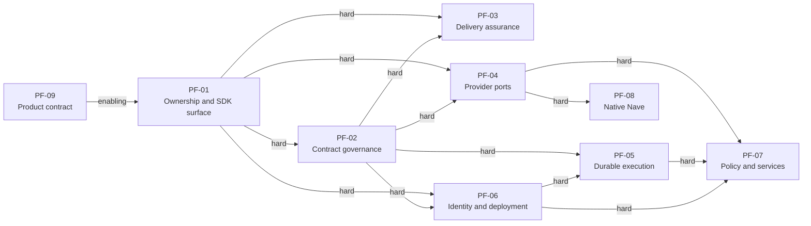
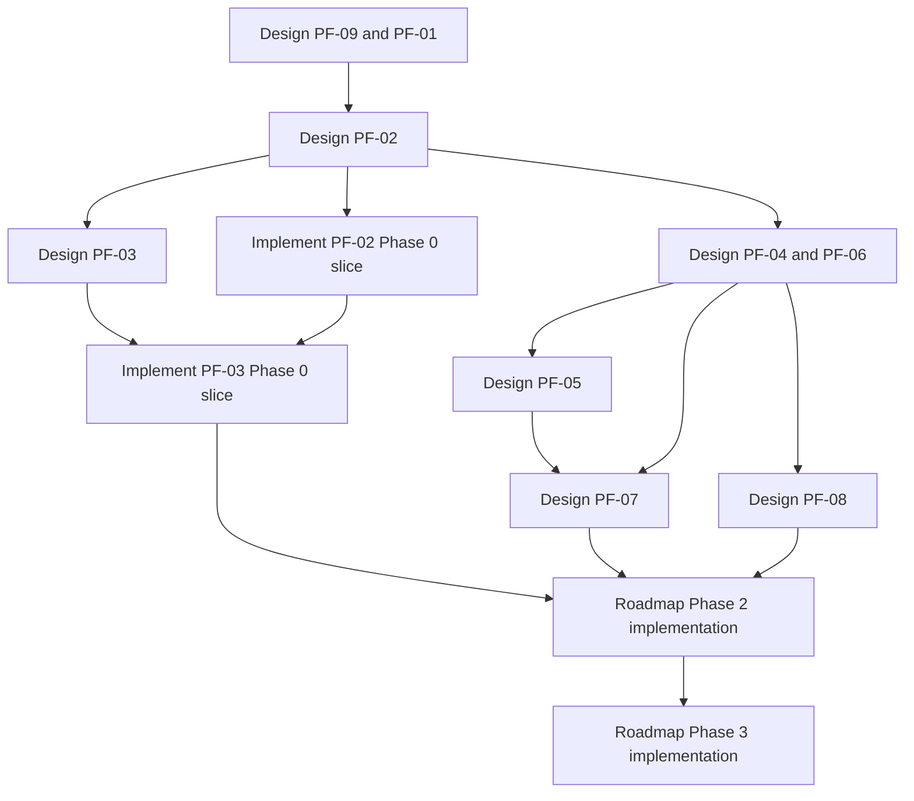
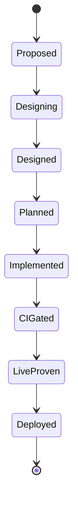

# Platform Foundation Program Decomposition Design

**Date:** 2026-08-19  
**Status:** Draft for written review  
**Decision:** Decompose roadmap Phases 0 and 1 into nine capability-centered programs  
**Scope:** Program ownership, dependencies, review units, evidence gates, and implementation milestones

## 1. Purpose

This document decomposes Phases 0 and 1 of the Pulse platform roadmap.
It defines the design programs that must precede the later implementation phases.

The platform roadmap remains the program-level design of record.
This document adds the review units that the roadmap requires.
It does not authorize implementation.

Each program gets a separate design specification and implementation plan.
A program can reach `Designed` before its implementation phase starts.

## 2. Decisions

The decomposition uses these decisions:

1. The program boundary follows a platform capability, not a repository.
2. The program map is a committed design artifact.
3. Each program gets a separate written specification.
4. Each specification names all affected repositories and branch flows.
5. Each specification names each contract producer and consumer.
6. Each dependency has one of the four roadmap dependency types.
7. Evidence moves a program between states.
8. A pull request number proves implementation only.
9. The Phase 0 schema and CI slices land before platform code moves.
10. Phase 1 completes contract design before Phase 2 package extraction starts.

The four dependency types are:

- Hard prerequisite
- Enabling dependency
- Operational deployment dependency
- Optional synergy

## 3. Boundary model

### 3.1 Selected model

The decomposition uses nine capability-centered programs.
A program owns one stable domain responsibility.
A repository can produce or consume contracts for several programs.

### 3.2 Rejected models

A phase-centered model creates one Phase 0 specification and one Phase 1 specification.
Each specification contains unrelated contracts and several repository cutovers.
This shape is too large for one implementation plan.

A repository-centered model creates one specification for each repository.
This shape splits shared contracts between their producers and consumers.
It also encourages duplicate policy and identity models.

### 3.3 Boundary rules

A valid program boundary has these properties:

- One domain responsibility
- One authoritative vocabulary
- Named public contracts
- Named producers and consumers
- Independent design review
- Independent implementation plan
- Observable completion evidence

A program must not own a transport adapter and the business rules behind that adapter.
A program must not use a current file location as its ownership reason.

## 4. Current evidence

The current repository structure supports capability boundaries.
Several domain responsibilities already exist as separate modules.

| Domain | Current evidence | Design implication |
|---|---|---|
| Result contracts | `validate_result.py`, `contract_versions.py`, and `lib/patterns/headless-contract.md` | Contract mechanics need one authority and one evolution model. |
| Workspace data | `config.yaml`, `relationships.yaml`, templates, workflow bindings, and direct YAML readers | The workspace schema needs a complete producer and consumer registry. |
| Apply policy | `apply_authorization.py`, `apply_driver.py`, `apply_reconcile.py`, and workspace authorization files | Policy rules need one transport-independent gateway. |
| Nave access | `nave_adapter.py` and direct CLI result normalization | Pulse needs a stable provider port before native bindings. |
| Durable state | Result files, run ledgers, apply journals, finalizer records, and poll state | Durable events and projections need one domain model. |
| Identity | Actor, machine, workspace, and scheduled mode fields appear in several contracts | Identity needs one vocabulary for local and hosted modes. |
| Delivery | The repository has no pull-request test workflow or required integration-branch job | Delivery assurance is a platform capability, not cleanup work. |
| Product | The roadmap and fleet UI research define operator jobs and governed remediation | Product scope must inform the public API without owning SDK internals. |

The root `pyproject.toml` still describes development tooling.
It exposes two console entry points for more than fifty implementation modules.

The live `relationships.yaml` shape differs from the evaluator shape.
This difference causes a false project-linkage result.

The scheduler reads workspace configuration and result contracts.
It also calls plugin skills by their current names.
Therefore, schema and command changes have cross-repository consumers.

## 5. Program catalog

### 5.1 PF-09: Fleet-governance product contract

**Purpose:** Define the product boundary and operator jobs before the SDK surface freezes.

**Owns:**

- Product wedge
- Operator job map
- Fleet visibility scope
- Evidence-to-outcome trace
- Governed remediation scope
- Read and action surface requirements
- Build, buy, and integration decision
- Product non-goals

**Excludes:**

- UI framework selection
- UI implementation architecture
- SDK module internals
- Mutation policy semantics

**Affected repositories:**

- Future fleet UI repository
- Future `hiivmind-pulse` repository
- `hiivmind-pulse-gh`

**Required evidence:**

- Primary-source competitor comparison
- Operator job map
- Build, buy, and wedge decision
- Read and action surface inventory
- Explicit product non-goals

**Output:** A product contract that provides consumer requirements to PF-01.

### 5.2 PF-01: Platform ownership and public SDK surface

**Purpose:** Define ownership and public interfaces before code moves.

**Owns:**

- Repository ownership
- Package and module boundaries
- Target location for every current module and artifact
- Public Python imports
- Public application-service API
- CLI entry-point model
- SDK version policy
- Release policy
- Deprecation and compatibility policy

**Excludes:**

- Business-rule redesign
- Storage implementation
- Transport protocol implementation
- UI implementation

**Affected repositories:**

- Future `hiivmind-pulse` repository
- `hiivmind-pulse-gh`
- `hiivmind-workspace`
- `hiivmind-pulse-scheduler`
- Future fleet UI repository

**Required evidence:**

- Complete module inventory
- Complete caller inventory
- Complete artifact inventory
- Target-ownership matrix
- Public API catalog
- Console entry-point catalog
- Release and version policy

**Output:** An ownership and API design that provides authority to all later programs.

### 5.3 PF-02: Contract and schema governance

**Purpose:** Create one authority for machine-readable contracts and workspace data.

**Owns:**

- Canonical workspace schema family
- Contract envelope rules
- Schema registry
- Contract version rules
- Backward-compatibility rules
- Migration rules
- Workspace validation command and library interface
- `relationships.yaml` migration
- Project-linkage evaluator conformance
- Contract producer and consumer registry

**Excludes:**

- Run and event semantics
- Storage engine behavior
- Business policy
- GitHub branch gate configuration

**Affected repositories:**

- Future `hiivmind-pulse` repository
- `hiivmind-pulse-gh`
- `hiivmind-workspace`
- `hiivmind-pulse-scheduler`
- Future fleet UI repository

**Required evidence:**

- Inventory of every schema writer
- Inventory of every schema reader
- Inventory of every template and live file
- Canonical schema set
- Migration matrix
- Compatibility policy
- Validator contract
- Live migration proof plan

**Output:** Versioned contracts and a clean migration path for all workspace consumers.

### 5.4 PF-03: Delivery assurance and evidence truth

**Purpose:** Make repository state, delivery gates, and program status trustworthy.

**Owns:**

- Pull-request CI
- Integration and release branch gates
- Workspace validation CI
- Scheduler structure CI
- Cross-repository compatibility matrix
- Contract producer and consumer jobs
- Capability-state evidence schema
- Backlog status normalization
- `gh-apply` documentation correction
- Sanitized credentialed probe policy

**Excludes:**

- Product capability implementation
- Contract semantics
- Runtime observability design
- Auto-merge

**Affected repositories:**

- `hiivmind-pulse-gh`
- `hiivmind-workspace`
- `hiivmind-pulse-scheduler`
- `discreteds/nave`
- Future `hiivmind-pulse` repository
- Future fleet UI repository

**Required evidence:**

- Required-job matrix by repository and branch
- Deterministic job definitions
- Branch gate inventory
- Contract compatibility matrix
- Capability-state evidence schema
- Credentialed probe inventory
- Current backlog evidence table

**Output:** Required delivery gates and an evidence model for every program state.

### 5.5 PF-04: External provider ports

**Purpose:** Define stable SDK boundaries for GitHub and Nave operations.

**Owns:**

- `GitHubClient` interface
- `NaveClient` interface
- Request and result types
- Error taxonomy
- Capability negotiation
- Lifecycle behavior
- Cancellation and timeout behavior
- Sync and async interface rules
- CLI and native provider parity contract
- Offline fixture provider

**Excludes:**

- PyO3 implementation
- GitHub product policy
- Authorization decisions
- Application orchestration

**Affected repositories:**

- Future `hiivmind-pulse` repository
- `hiivmind-pulse-gh`
- `discreteds/nave`

**Required evidence:**

- Complete GitHub operation catalog
- Complete Nave operation catalog
- Current error and result inventory
- Capability handshake inventory
- CLI and native parity fixtures
- Sync and async consumer scenarios

**Output:** Provider contracts that support CLI, native, fixture, and hosted adapters.

### 5.6 PF-06: Identity, tenancy, credentials, and deployment modes

**Purpose:** Define identity and ownership for local and hosted operation.

**Owns:**

- Tenant identity
- Workspace ownership
- Actor identity
- Machine identity
- Service identity
- Credential references and storage boundaries
- Local identity adapter
- Hosted identity adapter
- Local and hosted deployment model
- Cross-machine lease semantics
- Secret redaction requirements
- Identity audit fields

**Excludes:**

- Action authorization
- Approval policy
- Event storage implementation
- UI session implementation

**Affected repositories:**

- Future `hiivmind-pulse` repository
- `hiivmind-pulse-gh`
- `hiivmind-workspace`
- `hiivmind-pulse-scheduler`
- Future fleet UI repository

**Required evidence:**

- Local actor flow
- Hosted actor flow
- Scheduled actor flow
- Tenant and workspace model
- Credential boundary map
- Lease scenario map
- Threat model

**Output:** Identity and deployment contracts that PF-05 and PF-07 consume.

### 5.7 PF-05: Durable execution and fleet-state model

**Purpose:** Define durable run history and current fleet projections.

**Owns:**

- Run and event contract family
- Immutable event catalog
- Current-state projections
- Storage interfaces
- Ingestion rules
- Transaction boundaries
- Idempotency rules
- Replay behavior
- Concurrency rules
- Retention policy
- Redaction hooks
- SQLite and PostgreSQL adapter contract

**Excludes:**

- Authentication
- Authorization decisions
- UI presentation
- GitHub and Nave provider implementation

**Affected repositories:**

- Future `hiivmind-pulse` repository
- `hiivmind-pulse-gh`
- `hiivmind-workspace`
- Future fleet UI repository

**Required evidence:**

- One complete maintenance run mapped to events
- One complete apply run mapped to events
- Event identity catalog
- Projection definitions
- Replay and idempotency rules
- Transaction and concurrency model
- Retention and redaction policy

**Output:** A durable model that preserves history and derives current fleet state.

### 5.8 PF-08: Native Nave provider

**Purpose:** Expose Nave operations to Python without a subprocess boundary.

**Owns:**

- PyO3 module surface
- Rust-to-Python type conversion
- Tokio bridge
- GIL behavior
- Native error mapping
- Python packaging
- Binary and native package coexistence
- Release and compatibility policy
- CLI and native parity implementation

**Excludes:**

- Pulse business logic
- Pulse policy
- Pulse application services
- GitHub operations

**Affected repositories:**

- `discreteds/nave`
- Future `hiivmind-pulse` repository
- `hiivmind-pulse-gh`

**Required evidence:**

- One synchronous prototype
- One Tokio prototype
- Bound-surface matrix
- Async strategy
- Packaging and release design
- Error parity plan
- CLI and native parity plan

**Output:** A native provider that satisfies the PF-04 `NaveClient` contract.

### 5.9 PF-07: Policy, authorization, approvals, and application services

**Purpose:** Define one governed path for read actions and mutation actions.

**Owns:**

- Action catalog
- Authorization decision model
- Policy configuration model
- Approval lifecycle
- Approval ownership
- Application-service interfaces
- Journal and audit requirements
- Interactive actor policy
- Scheduled actor policy
- PR-only scheduled apply policy
- Reconciliation and finalization service boundaries

**Excludes:**

- FastAPI route design
- MCP tool design
- CLI argument design
- Direct base-branch push with `mutation_policy: allow`
- Auto-merge

**Affected repositories:**

- Future `hiivmind-pulse` repository
- `hiivmind-pulse-gh`
- `hiivmind-workspace`
- `hiivmind-pulse-scheduler`
- Future fleet UI repository

**Required evidence:**

- Read action catalog
- Mutation action catalog
- Authorization decision model
- Approval state model
- Interactive apply scenario
- Scheduled PR-only apply scenario
- Scheduled actor threat model
- Common journal and outcome model

**Output:** Shared services that every CLI, API, MCP, scheduler, and UI adapter calls.

## 6. Dependency graph

A source node must reach its required state before the target node can complete.
The edge labels state the dependency type.

PF-03 is also an operational delivery dependency for every implementation.
A program can reach `Designed` before PF-03 implementation is complete.
A program cannot reach `CI-gated` without its PF-03 compatibility jobs.

## 7. Design waves

The design waves maximize independent work without freezing incomplete interfaces.

| Wave | Programs | Completion gate |
|---|---|---|
| A | PF-09 research and PF-01 current-state inventory | Product jobs and the module, caller, and artifact inventories exist. |
| B | PF-09 approval, then PF-01 design | The product boundary and target ownership are fixed. |
| C | PF-02 | One contract authority and one migration model exist. |
| D | PF-03, PF-04, and PF-06 in parallel | Delivery, provider, and identity contracts are approved. |
| E | PF-05 and PF-08 in parallel | The durable model and native provider design are approved. |
| F | PF-07 | One policy and application-service path closes the contract phase. |

PF-09 research can run with the PF-01 inventory.
The PF-01 public surface cannot freeze before PF-09 approval.

PF-03 can design baseline CI before every later contract exists.
Its compatibility matrix closes only after the contract registry names all producers and consumers.

PF-07 can start when PF-04, PF-05, and PF-06 are approved.
PF-08 progress does not gate PF-07.

## 8. Implementation milestones

Design completion does not start all implementations.
The roadmap still controls implementation order.

### 8.1 First implementation slice

The PF-02 Phase 0 slice contains:

- Canonical workspace schemas
- Schema version and migration rules
- `relationships.yaml` migration
- Project-linkage evaluator correction
- Workspace validator

### 8.2 Second implementation slice

The PF-03 Phase 0 slice contains:

- Deterministic pull-request CI in `hiivmind-pulse-gh`
- Workspace validation CI
- Scheduler structure CI
- Required checks on `develop` and `main`
- Capability-state evidence table
- Backlog status correction
- `gh-apply` documentation correction

### 8.3 Design-only work before Phase 2

PF-01 and PF-04 through PF-09 reach `Designed` before their later implementations.
Their implementation plans remain separate.

The platform package extraction starts in roadmap Phase 2.
The native Nave implementation starts in the parallel Nave lane.
The durable service and scheduled apply implementation start in roadmap Phase 3.

## 9. Specification contract

Each program specification must contain these sections:

1. Domain responsibility
2. Explicit non-goals
3. Owning repository
4. Affected repositories and branch flows
5. Contract producers and consumers
6. Public interfaces and schemas
7. Version and compatibility rules
8. Dependency types and gates
9. Migration and clean cutover
10. Failure and recovery behavior
11. Security behavior
12. Test and CI strategy
13. Live-proof strategy
14. Observable exit evidence
15. Backlog records that the program supersedes or retains

A dependent specification cannot freeze an interface that its prerequisite leaves open.
The dependent program can complete inventory and research before that prerequisite closes.

Each specification uses this filename shape:

`docs/superpowers/specs/YYYY-MM-DD-pf-NN-<program-name>-design.md`

Each implementation plan uses this filename shape:

`docs/superpowers/plans/YYYY-MM-DD-pf-NN-<program-name>.md`

## 10. Review gates

Each program uses the same base review path.

Every program gets an adversarial architecture review.
A blocking finding returns the specification to design.

These programs also require a domain review:

| Program | Domain review |
|---|---|
| PF-05 | Data model, replay, idempotency, and transaction review |
| PF-06 | Identity, tenancy, credential, and deployment security review |
| PF-07 | Authorization, approval, and scheduled actor security review |
| PF-08 | Rust, Python, async, packaging, and release review |
| PF-09 | Product scope and primary-source competitor review |

The user reviews each corrected written specification.
The implementation plan starts only after that approval.

## 11. Program state model

The program map uses these states:

Each state change needs evidence.
A pull request number can move a program to `Implemented` only.

| State | Minimum evidence |
|---|---|
| Proposed | Approved program boundary and named owner |
| Designing | Active brainstorm with evidence inventory |
| Designed | Corrected specification and user approval |
| Planned | Corrected implementation plan and user approval |
| Implemented | Merged implementation and migration artifacts |
| CI-gated | Required deterministic and compatibility jobs pass |
| Live-proven | A defined live scenario produces retained evidence |
| Deployed | The live workspace or service uses the capability |

## 12. Initial program register

The decomposition creates this initial register:

| Program | State | Hard prerequisites | First implementation phase |
|---|---|---|---|
| PF-09 Product contract | Proposed | None | Phase 4 |
| PF-01 Ownership and SDK surface | Proposed | None | Phase 2 |
| PF-02 Contract and schema governance | Proposed | PF-01 | Phase 0 |
| PF-03 Delivery assurance | Proposed | PF-01, PF-02 | Phase 0 |
| PF-04 External provider ports | Proposed | PF-01, PF-02 | Phase 2 |
| PF-06 Identity and deployment | Proposed | PF-01, PF-02 | Phase 3 |
| PF-05 Durable execution | Proposed | PF-02, PF-06 | Phase 3 |
| PF-08 Native Nave provider | Proposed | PF-04 | Parallel Nave lane |
| PF-07 Policy and application services | Proposed | PF-04, PF-05, PF-06 | Phase 3 |

PF-09 has an enabling edge to PF-01.
This edge informs the public API but does not make PF-09 a hard implementation prerequisite.

## 13. Roadmap traceability

This table maps every Phase 0 and Phase 1 roadmap deliverable to one program.

| Roadmap deliverable | Program |
|---|---|
| Canonical workspace schema | PF-02 |
| Schema version and migration rules | PF-02 |
| Relationship data migration | PF-02 |
| Evaluator correction | PF-02 |
| Workspace validator | PF-02 |
| Backlog status correction | PF-03 |
| `gh-apply` documentation correction | PF-03 |
| Pull-request CI | PF-03 |
| Workspace validation CI | PF-03 |
| Scheduler structure CI | PF-03 |
| Required branch checks | PF-03 |
| Repository ownership design | PF-01 |
| Package and module boundary design | PF-01 |
| Public SDK API | PF-01 |
| Workspace schema family | PF-02 |
| Run and event contract family | PF-05 |
| Storage interfaces | PF-05 |
| `NaveClient` interface | PF-04 |
| GitHub client interface | PF-04 |
| Identity interface | PF-06 |
| Policy and approval interface | PF-07 |
| Application-service interface | PF-07 |
| Local and hosted deployment design | PF-06 |
| Scheduled apply decision | PF-07 |
| Native Nave interface decision | PF-08 |
| Cross-repository CI decision | PF-03 |
| Product wedge decision | PF-09 |

No Phase 0 or Phase 1 deliverable has two owners.

## 14. Completion criteria for this decomposition

This decomposition is complete when these conditions are true:

- The program boundary is approved.
- The dependency graph is approved.
- The design waves are approved.
- The implementation milestones are approved.
- The evidence requirements are approved.
- The review gates are approved.
- The roadmap links to this program map.
- The backlog index links to this program map.

After written approval, PF-09 is the first program brainstorm.
PF-01 inventory can start in parallel after its separate brainstorm approval.

## 15. Non-goals

This document does not design the nine programs.
It does not create the future SDK or UI repositories.
It does not select FastAPI, MCP, database, identity, or PyO3 libraries.
It does not authorize direct base-branch push.
It does not add auto-merge.
It does not change the Nave-only repository write rule.
