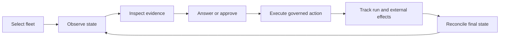
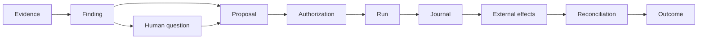

# PF-09 Fleet Operations Product Contract Design

**Date:** 2026-08-20  
**Status:** Draft for written review  
**Program:** PF-09 Fleet-governance product contract  
**Decision:** Build Pulse as a standalone, extensible fleet-operations capability platform  
**Scope:** Product boundary, operator jobs, capability registry, extension contracts, workbench requirements, and build decision

## 1. Purpose

This document defines the PF-09 product contract for Hiivmind Pulse.
It fixes the product boundary before PF-01 freezes the public SDK surface.

Pulse serves the full fleet-operations capability suite.
Governed remediation is its first product wedge and primary operator journey.
It does not limit the capabilities that Pulse can run, present, or extend.

This design defines product requirements.
It does not select a UI framework or authorize implementation.

## 2. Decisions

PF-09 uses these decisions:

1. Pulse is a standalone fleet-operations capability platform.
2. GitHub-centric small teams and open-source maintainers are co-primary operators.
3. The product supports fleets that span one or more GitHub organizations.
4. The product does not require an enterprise service catalog.
5. GitHub is the first-class built-in provider.
6. Committed workspace documents, folders, relationships, standards, and policy are first-class sources.
7. Governed remediation organizes the product experience.
8. The complete workflow suite and future registered capabilities define the product scope.
9. A versioned capability registry drives the universal workbench surfaces.
10. Extensions use explicit capability, provider, projection, surface, runtime, and storage ports.
11. Local and hosted deployments use the same capability and action contracts.
12. Every mutation uses shared identity, policy, authorization, journal, and application services.
13. Nave remains the only clone-write repository engine.
14. Linear is a likely work-management plugin, not a core product dependency.
15. External analysis packages can keep independent packaging and privacy rules.
16. Cortex, Port, OpsLevel, and Backstage remain integration targets, not product foundations.

## 3. Product promise

Pulse turns live fleet evidence into explainable, governed action.
It gives operators one place to answer these questions:

- What changed?
- What needs attention?
- Why does it matter?
- What evidence supports the conclusion?
- What decision does the system need?
- What safe action is available?
- What is running now?
- What happened after approval?
- What is the final fleet and per-target outcome?

The complete operator loop is:

Pulse owns this experience.
GitHub remains the repository truth and pull-request landing system.
External trackers remain planning and collaboration systems.

## 4. Operators and operating model

### 4.1 Co-primary operators

The first operator is a maintainer or small team that manages a GitHub organization.
This operator manages approximately ten to one hundred repositories without an enterprise service catalog.

The second operator is an open-source maintainer.
This operator manages repositories across organizations with different visibility and permission models.

Neither operator requires a dedicated platform engineering department.
Neither operator must buy seats in an enterprise internal developer platform.

### 4.2 Fleet definition

A fleet is an explicit, reusable repository set.
It combines repository identities with GitHub-backed selectors.
It can span organizations and mix public and private repositories.

A fleet is not a service catalog.
Repository discovery does not require a separate ownership ontology.
Workspace data can enrich repository meaning and declare intended state.

Read-only discovery requires GitHub authentication only.
Governed mutation requires committed workspace configuration and authorization state.

### 4.3 Deployment modes

Pulse supports local and hosted operation as adapters over one product contract.
They are not separate products.

Local mode uses local credentials, workspace access, and allowed local execution runtimes.
Hosted mode uses service identity, remote workspace access, and hosted execution runtimes.
Split mode places separate pipeline stages in approved local or hosted locations.

Every mode uses the same capability identities, result states, action identities, and audit vocabulary.

## 5. Operator jobs

The product organizes work around six operator jobs.
It does not expose the current implementation phase names as product navigation.

### 5.1 Orient

The operator asks what needs attention across the selected fleet.
Pulse presents health, drift, decisions, active work, blocked work, and recent outcomes.

### 5.2 Investigate

The operator asks what evidence produced a finding.
Pulse presents observations, intended state, provenance, affected targets, history, and uncertainty.

### 5.3 Decide

The operator answers a human question or reviews a proposed action.
Pulse explains the exact decision, consequences, policy result, and affected targets.

### 5.4 Act

The operator starts an assessment, records an answer, or authorizes a proposal.
Every action uses the shared application-service path.

### 5.5 Track

The operator follows running, blocked, failed, awaiting-review, merged, and reconciled work.
Fleet rollups never hide per-target states.

### 5.6 Govern

The operator manages fleets, intended standards, capability configuration, provider status, permissions, and durable exceptions.
The workbench shows configuration authority and source provenance.

## 6. Current capability suite

The current suite proves that Pulse is broader than one governance dashboard.
The items in this section are current instances, not a closed product catalog.

### 6.1 Live workflow deployments

The live workspace contains these workflow deployments:

| Workflow | Current product job |
|---|---|
| `auto-refresh` | Refresh stale workspace configuration |
| `ci-monitor` | Detect and classify continuous-integration failures |
| `dependabot-alerts` | Surface and prioritize dependency vulnerabilities |
| `deploy-monitor` | Track deployments and surface failures |
| `generated-artifact-audit` | Detect generated-content drift and propose regeneration |
| `impact-audit` | Audit cross-repository dependency currency |
| `issue-triage` | Detect untriaged issues and propose metadata updates |
| `marketplace-sync` | Audit marketplace bindings and propose updates |
| `plan-sync` | Reconcile committed plans and bound work items |
| `pr-lifecycle` | Summarize pull-request state and review needs |
| `project-sync` | Detect project-board changes and actionable work |
| `release-monitor` | Track releases and follow-up work |
| `stale-check` | Detect stale pull requests and issues |

### 6.2 Current result and evidence contracts

The current headless contract contains these result kinds:

- `status`
- `healthcheck`
- `fleet-membership`
- `refresh`
- `workflow-run`
- `impact`
- `repo-mutation`
- `apply-status`
- `generated-artifact`
- `plan-sync`

The dependency snapshot is a separate evidence contract.
Future kinds enter through the same versioned registry rules.

### 6.3 Capability families

The current suite establishes these capability families:

- Workspace lifecycle
- Governance and dependency health
- GitHub operations
- Cross-repository integrity
- Governed mutation
- Workflow operations

A new family can enter without changing the workbench core.

## 7. Capability registry

### 7.1 Descriptor

Each capability registers one versioned descriptor.
The descriptor contains these product fields:

| Field group | Required content |
|---|---|
| Identity | Stable ID, display name, version, category, and owning package |
| Configuration | Input schema, configuration schema, defaults, and migration rules |
| Requirements | Provider capabilities, secrets, storage, execution placement, and dependencies |
| Modes | Interactive, scheduled, local, hosted, and split support |
| Evidence | Evidence types, result types, artifact types, and provenance rules |
| Decisions | Finding, human-question, proposal, and outcome types |
| Operations | Read operations, governed actions, triggers, reconciliation, and finalization |
| Policy | Authorization hooks, risk class, approval class, and audit requirements |
| Presentation | Generic labels, summaries, fields, relationships, and optional specialized views |
| Compatibility | Contract ranges, provider ranges, extension ranges, and upgrade behavior |

The descriptor is data.
It must not contain hidden business logic or unvalidated command text.

### 7.2 Capability lifecycle

A capability can have these registry states:

- `available`
- `configured`
- `degraded`
- `unsupported`
- `disabled`
- `incompatible`
- `error`

A descriptor classifies each provider capability as required or optional for one operation or stage.
A missing required capability produces `unsupported`, and no dependent stage starts.
A missing optional capability produces `degraded` only when the descriptor defines that behavior and result shape.
Pulse must not infer a fallback or replace a missing capability with GitHub-specific behavior.

### 7.3 Workflow deployment

A configured workflow is a deployment of a capability descriptor.
It is not the capability itself.

A workflow selects configuration, trigger policy, schedule, fleet, mode, and deployment location.
Several workflows can deploy the same capability with different policies.

### 7.4 Capability forms

A capability can be:

- Read-only
- Analysis-only
- Human-question-producing
- Proposal-producing
- Action-capable
- Reconciliation-capable

Governed remediation is available to all applicable capabilities.
It is not mandatory for a capability to produce a mutation.

## 8. Extension architecture

### 8.1 Capability plugins

A capability plugin can register these elements:

- Domain models and schema versions
- Evidence collectors
- Artifact types and lineage
- Incremental pipeline stages
- Evaluators and deterministic joins
- Classifiers and findings
- Human questions
- Proposal builders
- Governed actions
- Triggers and schedules
- Reconciliation and finalization handlers
- Generic presentation metadata
- Specialized views and reports

A plugin registers only the elements it owns.
It does not receive ownership of shared policy, identity, journals, or action execution.

### 8.2 Provider plugins

Provider ports cover these external responsibilities:

- Repository and source control
- Work management
- Internal developer platforms
- Identity and secrets
- Storage and artifacts
- Notifications
- Agent and tool access
- Execution runtimes

A provider advertises a versioned capability set.
Consumers negotiate that set before they invoke an operation.

GitHub is the built-in provider.
Linear is a likely work-management plugin.
Cortex, Port, OpsLevel, and Backstage are likely IDP plugins.

### 8.3 Projection plugins

A projection plugin adds a read model, report, notification, or declarative view.
It consumes registered contracts and does not reimplement evaluation rules.

A capability gets a usable generic presentation without a projection plugin.
A projection plugin adds domain depth without forking the workbench shell.

Projection plugins are pure data-in and data-out extensions.
They receive only declared fields through a read-only projection API.
They cannot execute code in the workbench or read credentials, storage internals, or private artifacts from another capability.
Undeclared fields are never exposed.

### 8.4 Surface extensions

A surface extension adds executable specialized user-interface behavior.
It runs outside the universal shell trust boundary.

The platform loads a surface extension only after explicit trust approval.
The extension declares provenance, required data, and required platform capabilities.
It reads only its granted projection API and invokes actions only through shared application services.

A failed surface extension cannot disable universal views or unrelated capabilities.

### 8.5 Runtime plugins

A runtime plugin executes registered capability stages.
It can use an in-process library, native binding, remote service, worker, notebook bridge, or approved subprocess adapter.

The capability contract does not assume that every extension has a CLI or HTTP service.

### 8.6 Plugin failure boundary

One plugin failure must not make unrelated capabilities unavailable.
The registry records the failed plugin, affected capabilities, evidence, and recovery action.

Pulse rejects invalid manifests, unsupported contract versions, and failed capability negotiation.
It does not load a partial extension as healthy.

## 9. Universal workbench contract

### 9.1 Universal surfaces

The workbench provides these registry-driven surfaces:

- Capability catalog
- Fleet and repository state
- Unified attention queue
- Evidence and finding detail
- Human-question queue
- Proposal and approval queue
- Run and journal history
- Pull-request, external-effect, reconciliation, and outcome trace
- Workflow configuration and deployment status
- Extension, provider, and compatibility status

These surfaces use common contracts.
They do not require one hard-coded screen for each workflow.

### 9.2 Generic presentation

The workbench renders an extension from its schema and presentation metadata.
It supports typed fields, tables, relationships, timelines, diffs, states, provenance, and actions.

Generic rendering is the minimum extension contract.
A plugin can add a specialized view when the domain needs a richer presentation.

### 9.3 Finding detail

Every finding view answers these questions:

- What did Pulse observe?
- What intended state did it use?
- Why does the difference matter?
- What evidence supports the conclusion?
- Which targets and artifacts are affected?
- What uncertainty remains?
- What safe next actions exist?

A finding can exist without a safe remediation.
Pulse states that condition directly.

### 9.4 Agent and human parity

The UI and embedded agent use the same read and action contracts.
The agent can explain current evidence and invoke registered actions.
It has no private mutation surface.

CLI, API, MCP, scheduler, and UI adapters converge on the same application services.

## 10. Evidence-to-outcome trace

### 10.1 Canonical trace

The canonical trace is:

Each stage links to its predecessor and successor.
PF-05 defines the durable event and storage contracts.
PF-09 requires the trace to remain explainable end to end.

### 10.2 Decision invariants

A human question is not a mutation approval.
A proposal is not an executable action until authorization succeeds.

Approval binds to these values:

- Proposal identity
- Proposal digest
- Capability and action identity
- Target selection
- Expected evidence or revisions
- Actor identity
- Policy result

New or stale evidence blocks or supersedes the old proposal.
The workbench must not present a stale proposal as executable.

### 10.3 Multi-target outcomes

One run can affect several repositories, work items, or artifacts.
The product shows one run rollup and independent target outcomes.

A partial result remains partial.
Successful targets do not hide blocked or failed targets.

A pull request is execution evidence.
It is not completion evidence.
Reconciliation and declared final state determine completion.

### 10.4 Durable negative outcomes

The trace retains these outcomes:

- Rejected decisions
- Expired leases
- Failed checks
- Provider errors
- Conflicts
- Superseded proposals
- Abandoned runs
- Partial application
- Unsupported operations

The product must not erase failed history to make the current state look clean.

## 11. Core sources and integration boundaries

### 11.1 GitHub

GitHub is first-class product infrastructure.
The built-in provider covers repositories, organizations, issues, Projects, pull requests, checks, workflows, releases, deployments, and permissions.

GitHub remains the repository and pull-request truth.
GitHub API shapes remain inside the provider boundary.

### 11.2 Committed workspace state

Committed workspace state is first-class product data.
It includes documents, folders, relationships, fleet definitions, standards, workflow deployments, authorization, and durable governance decisions.

The workbench can show read-only GitHub state without a workspace.
A governed mutation requires workspace authorization and binding state.

### 11.3 Reconciliation

Pulse owns the canonical reconciliation record and its schema.
The record contains stable target identity, mapped fields, authority policy, observed revision, common base, conflicts, and guarded proposals.

A provider maps its remote objects into that canonical record.
Only mapped canonical fields participate in reconciliation.
Provider-only data remains opaque extension data.

Each reconciliation binding names one provider target.
Several bindings to the same source reconcile independently and do not create implicit field precedence.
Cross-provider reconciliation requires an explicit topology and authority policy in the capability descriptor.

A plugin cannot change the canonical record when it loads.
PF-02 schema governance controls additions and migrations.

The current GitHub plan synchronization is the built-in implementation of this domain.
It does not define the complete reconciliation scope.

Document patches and provider mutations remain separate proposals.
Conflicts become human questions.
Confirmed writes advance only the relevant recorded base.

### 11.4 Linear

Linear is a named likely work-management plugin.
It is not a core provider or PF-09 implementation requirement.

A future Linear adapter maps its supported objects and operations to Pulse provider and reconciliation contracts.
Linear-specific concepts remain provider data unless PF-02 adds them to a canonical contract.

### 11.5 IDP integrations

Cortex, Port, OpsLevel, and Backstage can consume Pulse evidence, capabilities, and governed actions through provider ports.
They do not become the product authority.

Pulse does not require their catalogs for repository discovery or fleet operation.

## 12. Data, privacy, and execution placement

### 12.1 Artifact contract

Each artifact declares these properties:

- Stable type and schema version
- Producing capability and plugin version
- Source evidence and lineage
- Data classification
- Allowed storage locations
- Allowed execution locations
- Egress and redaction rules
- Retention policy
- Cache identity
- Incremental recomputation rules

The artifact contract supports files, database records, object storage, streams, and external references.

### 12.2 Placement modes

A pipeline stage declares one of these placement policies:

- Local only
- Hosted only
- Local or hosted
- Split execution

Split execution defines the artifacts that cross the boundary.
The registry rejects an execution plan that violates artifact placement or egress rules.

The registry resolves every required runtime, provider capability, and placement before a run starts.
A failed required preflight produces `unsupported`, and no stage starts.
An optional gap produces `degraded` only under declared descriptor semantics.

Pulse never moves a stage between local and hosted locations as an implicit fallback.
A placement change creates a new execution plan.

A required mid-run provider failure stops every dependent stage.
Independent stages or targets continue only when the descriptor declares their dependency and partial-result semantics.
Completed artifacts remain marked as incomplete evidence until the capability reaches a declared result state.
Incomplete evidence cannot satisfy an action precondition.

### 12.3 PointBreak conformance scenario

PointBreak is an external predictive dependency-intelligence package.
It combines source API changes with private consumer usage to find relevant breaking changes.

The package has raw, bronze, silver, and gold data stages.
Its consumer call-site evidence must remain on the operator machine.
It can place source-surface analysis remotely and consumer-impact analysis locally.

PointBreak proves these extension requirements:

- Independent package ownership
- Domain-specific models and reports
- Multi-stage artifacts and lineage
- Incremental analysis
- Local privacy enforcement
- Split execution
- Read-only and finding-producing capability forms
- Open-core engine and separate ruleset packages
- Library or notebook execution without a required CLI

PointBreak is a conformance scenario.
It does not become a PF-09 core capability.

## 13. Packaging and compatibility

### 13.1 Independent packages

Extensions use independent package names, versions, release policies, and licenses.
Pulse records the loaded package and descriptor versions with each run.

An open-core engine can load separately packaged private or proprietary rulesets.
The module boundary must preserve the declared package and data boundary.

### 13.2 Compatibility

The registry validates these ranges:

- Pulse platform version
- Capability descriptor version
- Result and artifact contract versions
- Provider port versions
- Runtime port versions
- Extension dependencies

An incompatible extension enters `incompatible`.
It does not run with guessed compatibility.

### 13.3 Migration

A breaking descriptor, result, artifact, or provider change requires an explicit migration path.
Additive optional data follows the contract-version policy owned by PF-02.

Migration evidence identifies producers, consumers, old versions, new versions, and cutover order.

### 13.4 Provenance

The platform records extension origin, package digest, version, and declared publisher.
A hosted deployment can require signed or approved extensions.

PF-06 and PF-07 define trust and authorization policy.
PF-09 requires the product to expose extension provenance and trust state.

## 14. Primary-source competitor comparison

The competitor pattern is proven.
The selected operating model remains distinct.

| Product | Primary-source evidence | Proven capability | Difference from Pulse |
|---|---|---|---|
| Cortex | [Scorecards](https://docs.cortex.io/standardize/scorecards) and [Workflows](https://docs.cortex.io/streamline/workflows) | Continuous standards, actionable failures, multi-step workflows, integrations, and manual approval | Starts from catalog entities and a vendor workspace. Pulse starts from GitHub fleets and committed workspace state. |
| Port | [Dynamic permissions](https://docs.port.io/workflows/actions-and-automations/create-self-service-experiences/set-self-service-actions-rbac/dynamic-permissions/) and [Port MCP server](https://github.com/port-labs/port-mcp-server) | Governed self-service actions, dynamic approvers, catalog-based policy, and agent access | Uses catalog data as the permission and action context. Pulse does not require a catalog. |
| OpsLevel | [OpsLevel MCP](https://docs.opslevel.com/mcp) and [official MCP source](https://github.com/OpsLevel/opslevel-mcp) | Agent access to catalog, checks, scorecards, ownership, and dependencies | Centers service-catalog maturity. Pulse centers fleet evidence and governed operations for small and open-source teams. |
| Backstage | [Software Catalog](https://backstage.io/docs/features/software-catalog/) and [Software Templates](https://backstage.io/docs/features/software-templates/) | Self-hosted catalog, source-controlled metadata, plugins, templates, tasks, and custom actions | Requires a developer-portal and catalog operating model. Pulse provides a focused fleet capability platform. |

### 14.1 Build decision

Pulse will build its standalone workbench and capability contracts.
It will not use an IDP as its product shell.

The build decision preserves these differentiators:

- Catalog-free GitHub fleet discovery
- Git-committed governance state
- Small-team and open-source operating model
- Existing typed workflow and result contracts
- Existing fenced, journaled, pull-request-gated mutation path
- Local, hosted, and split execution
- Extension packages with explicit privacy and placement rules

### 14.2 Integration decision

IDPs, work trackers, and agent runtimes remain integration surfaces.
They can read Pulse state and invoke authorized Pulse actions.
They cannot replace Pulse evidence, policy, journal, or final outcome authority.

## 15. Failure and security behavior

### 15.1 Fail closed for actions

Missing identity, policy, authorization, evidence, lease, fence, or provider preconditions block an action.
No adapter can create an alternate mutation path.

### 15.2 Fail soft for independent reads

One failed provider or capability does not erase healthy independent results.
The workbench shows the failed boundary and its affected scope.

### 15.3 Secret handling

Capability descriptors reference secrets by identity.
They do not embed secret values.

Logs, artifacts, findings, and agent context follow declared redaction and egress rules.

### 15.4 Untrusted extensions

An extension cannot gain action authority by declaring an action.
PF-07 policy and authorization decide execution.

The platform exposes extension provenance, requested capabilities, granted capabilities, and current trust state.

Untrusted extension code runs outside the workbench and application-service trust boundary.
It receives only granted data and provider capabilities.
It cannot load executable code into the universal shell.

### 15.5 Agent safety

An agent sees only authorized data and actions.
The same action contract applies to buttons, chat tools, API calls, CLI calls, and scheduled runs.

An agent explanation is not evidence.
An inferred finding remains marked as inferred.

## 16. Acceptance scenarios

### 16.1 Small-team discovery

A small team authenticates GitHub and selects repositories.
Pulse presents useful read-only fleet state without a service catalog.

### 16.2 Multi-organization open-source fleet

An open-source maintainer selects repositories across organizations.
Pulse shows public and private visibility plus per-repository permission differences.

### 16.3 Existing workflow coverage

Every live workflow deployment appears through a registered capability or generic workflow contract.
No current workflow needs a custom workbench shell change to expose its common states.

### 16.4 New capability registration

A new analysis-only package registers models, evidence, findings, artifacts, and presentation metadata.
It runs and appears in the workbench without a core workbench change.

### 16.5 Specialized presentation

A capability adds a declarative specialized report through a projection plugin.
The report uses the same identity, evidence, history, and action services as generic views.

A trusted surface extension adds executable interaction through an isolated, capability-scoped API.
Its failure leaves the universal presentation usable.

### 16.6 GitHub and document reconciliation

Pulse detects a one-sided document or GitHub work-item change.
It produces independent guarded proposals and advances the base after confirmed application.

A concurrent change produces a human-visible conflict.

### 16.7 Governed multi-repository remediation

An operator traces one finding through proposal, exact approval, per-repository pull requests, checks, reconciliation, and final outcomes.
A blocked repository remains visible beside successful repositories.

### 16.8 Stale proposal

New evidence invalidates a pending proposal.
Pulse blocks execution and links the superseded proposal to the new evidence.

### 16.9 Linear plugin compatibility

A future Linear plugin advertises supported work-management capabilities.
Pulse uses those capabilities through provider ports without Linear-specific core logic.

Unsupported Linear operations produce explicit states.

### 16.10 PointBreak privacy and split execution

PointBreak source analysis runs in an approved remote location.
Consumer call-site analysis remains local.
Only allowed artifacts cross the boundary.

### 16.11 Split provider degradation

A split capability cannot resolve one required remote provider during preflight.
The run becomes `unsupported`, and no local or hosted stage starts.

An optional provider gap becomes `degraded` only when the descriptor defines the reduced result.
A required provider failure during execution stops dependent stages and marks completed artifacts as incomplete evidence.
Independent declared targets can continue.

### 16.12 Local and hosted parity

Local and hosted deployments present the same capability states and action identities.
Both invoke the same application services.

### 16.13 Plugin failure isolation

One invalid or failing extension becomes unavailable.
Unrelated capabilities remain usable and retain their evidence.

## 17. Program interfaces

PF-09 owns product vocabulary and user-visible outcomes.
The remaining programs implement the required contracts.

| Program | PF-09 requirement |
|---|---|
| PF-01 | Public capability, extension, workbench, and adapter surfaces match this product boundary. |
| PF-02 | Descriptor, evidence, result, artifact, migration, and compatibility schemas have one authority. |
| PF-03 | Every producer and consumer has deterministic compatibility and delivery evidence. |
| PF-04 | GitHub, Nave, work-management, IDP, notification, runtime, and storage ports use explicit contracts. |
| PF-05 | Runs, events, artifacts, journals, projections, lineage, and final outcomes remain durable and traceable. |
| PF-06 | Local, hosted, and split modes have identity, tenancy, credential, trust, and placement contracts. |
| PF-07 | Every read and mutation action uses one policy, approval, authorization, and application-service path. |
| PF-08 | Native Nave satisfies the repository-operation provider contract without leaking Rust or CLI details. |

PF-09 does not own the internal design of these programs.
It supplies their product requirements and acceptance journeys.

## 18. Affected repositories and branch flow

### 18.1 Affected repositories

The product contract affects these repositories:

- Future `hiivmind-pulse` repository
- `hiivmind-pulse-gh`
- `hiivmind-workspace`
- `hiivmind-pulse-scheduler`
- `discreteds/nave`
- Future fleet workbench repository
- External capability and provider repositories

PF-09 does not move code between these repositories.
PF-01 defines ownership and package boundaries.

### 18.2 Branch flow

Each implementation repository uses its own integration branch and pull request.
Mountainash repositories use their documented three-tier flow.

Cross-repository contract changes publish producer evidence before consumer cutover.
PF-03 defines the required compatibility jobs.

No program pushes directly to an integration or production branch.

## 19. Verification strategy

### 19.1 Product-contract verification

PF-09 completes through reviewable evidence:

- Primary-source competitor comparison
- Co-primary persona definition
- Operator job map
- Complete current workflow inventory
- Universal surface inventory
- Capability descriptor contract
- Extension and provider contract inventory
- Data placement and privacy model
- Canonical evidence-to-outcome journey
- Build, buy, and integration decision
- Explicit product non-goals
- PF-01 through PF-08 traceability

### 19.2 Later contract tests

Later programs must provide these tests:

- Descriptor schema and migration tests
- Capability registry compatibility tests
- Provider conformance tests
- Generic presentation tests
- Action-path parity tests across UI, API, MCP, CLI, and scheduler
- Plugin failure-isolation tests
- Local, hosted, and split placement tests
- Evidence-to-outcome trace completeness tests
- Cross-repository producer and consumer compatibility tests

Tests must assert behavior and contracts.
They must not assert a fixed count of capabilities, workflows, or plugins.

### 19.3 Live proof

A live proof uses one current read-only capability and one current governed mutation capability.
It also loads one external analysis capability through the extension contract.

The proof must show generic presentation, specialized presentation, authorization, trace history, and failure isolation.

## 20. Exit criteria

PF-09 reaches `Designed` when these conditions are true:

- The product promise and co-primary operators are approved.
- The standalone build decision is approved.
- The full capability-platform scope is approved.
- The existing workflow inventory is complete.
- The capability descriptor and lifecycle are explicit.
- The extension layers and failure boundaries are explicit.
- GitHub core status and other provider roles are explicit.
- Local, hosted, and split execution requirements are explicit.
- The evidence-to-outcome trace and decision invariants are explicit.
- Product non-goals are explicit.
- Every requirement maps to a later platform program.
- Product and primary-source competitor reviewers approve the written design.

PF-09 has no direct implementation phase before Phase 4.
Its approved contract informs PF-01 and every later product surface.

## 21. Non-goals

PF-09 does not:

- Select a UI framework
- Design UI components or routes
- Create a general service catalog
- Create a generic agent builder
- Design incident management
- Design deployment orchestration
- Design developer-productivity analytics
- Define SDK module internals
- Define provider method signatures
- Define storage tables
- Define identity or tenant schemas
- Define mutation policy semantics
- Implement Linear, IDP, or PointBreak plugins
- Permit direct repository writes from a UI or plugin
- Permit direct base-branch push
- Add auto-merge

## 22. Sources

### Internal sources

- [Platform development roadmap](2026-08-19-platform-development-roadmap-design.md)
- [Platform foundation program decomposition](2026-08-19-platform-foundation-program-decomposition-design.md)
- [Fleet UI prior art](../../backlogs/2026-08-17-agent-native-fleet-ui-prior-art.md)
- [Fleet UI backlog](../../backlogs/2026-08-17-agent-native-fleet-ui.md)
- [`headless-contract.md`](../../../lib/patterns/headless-contract.md)
- [`workflow-execution.md`](../../../lib/patterns/workflow-execution.md)
- [`plan-sync-binding.md`](../../../lib/patterns/plan-sync-binding.md)
- [`run-ledger.md`](../../../lib/patterns/run-ledger.md)
- `mountainash-pointbreak/CLAUDE.md`, read as a capability-extension conformance source

### Primary competitor sources

- [Cortex Scorecards](https://docs.cortex.io/standardize/scorecards)
- [Cortex Workflows](https://docs.cortex.io/streamline/workflows)
- [Port dynamic permissions](https://docs.port.io/workflows/actions-and-automations/create-self-service-experiences/set-self-service-actions-rbac/dynamic-permissions/)
- [Port MCP server](https://github.com/port-labs/port-mcp-server)
- [OpsLevel MCP documentation](https://docs.opslevel.com/mcp)
- [OpsLevel MCP source](https://github.com/OpsLevel/opslevel-mcp)
- [Backstage Software Catalog](https://backstage.io/docs/features/software-catalog/)
- [Backstage Software Templates](https://backstage.io/docs/features/software-templates/)
